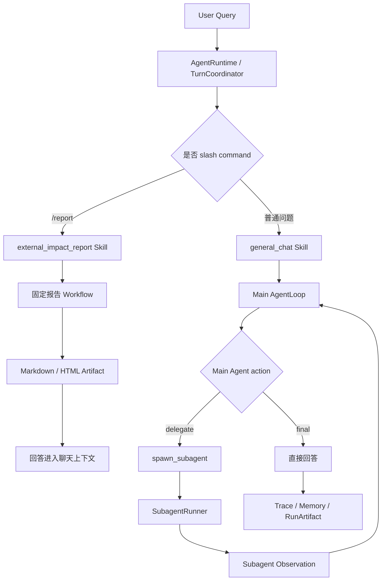

# Agent Workbench Subagent Harness 设计说明

本文档用于学习当前项目里的 Subagent Harness 设计。它不是业务功能说明，而是回答一个核心问题：

> 主 Agent 如何在受控的 Runtime 中，按需启动子智能体，并且让子智能体的上下文、工具、权限、生命周期和 Trace 都能被治理。

当前版本不实现代码执行沙箱，也不接入 `sandbox-runner`。原因是本项目的业务核心是外部变化影响分析、报告生成、证据核验和对话复盘，暂时没有必要让 Agent 执行任意代码。未来如果加入数据分析代码执行，只能放进临时目录或容器隔离环境。

## 0. 总体定位

本项目里有两类执行形态：

1. 固定 Workflow：例如 `/report`。它适合生成报告，阶段固定，可回归、可复盘。
2. 主 Agent Loop：普通对话默认进入主 Agent。主 Agent 可以直接回答，也可以在需要时返回 `delegate` action，由 Runtime 启动子智能体。

这两类不冲突。`/report` 是一个 Skill，它内部可以调用 workflow；普通聊天是 AgentLoop，它可以把子智能体当成受控工具使用。



你面试时可以这样讲：

> 这个项目不是把几个 prompt 串起来，而是把普通对话、固定 Workflow 和动态 Subagent 委派都放进统一 Runtime。Runtime 负责 skill 路由、上下文构建、权限边界、子智能体生命周期、Trace 和 Artifact。

## 1. AgentManifest

### 1.1 为什么需要 AgentManifest

如果只让模型“想启动什么角色就启动什么角色”，系统会出现三个问题：

1. 角色漂移：模型临时编一个“超级分析师”“高级专家”，权限和职责无法审计。
2. 工具越权：子智能体可能拿到不该拿的工具，例如写 Memory、发布报告、修改产物。
3. Trace 不稳定：每次角色名称和输出结构都不同，后续无法评测和回归。

所以当前实现把子智能体能力声明为 `SubagentManifest`。主 Agent 只能看到一个受控的 `agent_roster`，不能任意创建角色。

核心文件：

- `D:\AAAcode\code-code\agent+\harness\policy_impact\src\policy_impact\runtime\subagent_manifests.py`
- `D:\AAAcode\code-code\agent+\harness\policy_impact\src\policy_impact\runtime\subagent_roles.py`
- `D:\AAAcode\code-code\agent+\harness\policy_impact\src\policy_impact\skills\registry.py`

### 1.2 Manifest 字段

`SubagentManifest` 描述的是“主 Agent 可见的委派说明书”。

| 字段 | 作用 |
| --- | --- |
| `name` | 给人看的能力名称，例如 `skeptic-reviewer` |
| `role` | Runtime 真正识别的角色 ID，例如 `skeptic` |
| `description` | 主 Agent 判断是否委派时看到的能力描述 |
| `use_when` | 什么时候应该启动这个子智能体 |
| `avoid_when` | 什么时候不应该启动，避免过度委派 |
| `tools` | 该角色理论上可用的工具集合 |
| `disallowed_tools` | 明确禁止的工具，例如 `memory_write`、`report_write` |
| `output_schema_name` | 子智能体必须返回的结构化输出契约 |
| `max_turns` | 子智能体最多循环步数 |
| `max_model_calls` | 子智能体最多模型调用次数 |
| `timeout_seconds` | 子智能体超时上限 |
| `context_policy_id` | 子智能体上下文策略 ID |
| `memory_scope` | 当前是 `read_only`，不允许子智能体写长期记忆 |
| `can_publish` | 当前都是 `False`，子智能体不能直接发布最终报告 |

### 1.3 当前内置角色

当前四个角色是为了覆盖业务 Agent 中最常见的底层能力：

| Manifest | Role | 适合场景 | 不能做什么 |
| --- | --- | --- | --- |
| `evidence-researcher` | `collector` | 收集来源、证据、历史产物，不发表结论 | 不写 Memory，不生成报告 |
| `impact-analyst` | `analyst` | 做结构化影响分析、拆解取舍和建议 | 不在缺少证据时强行下结论 |
| `skeptic-reviewer` | `skeptic` | 质疑结论、找反例、找证据缺口 | 不替代最终回答 |
| `claim-verifier` | `verifier` | 核验 claim 是否有 evidence 支撑 | 不凭空生成新事实 |

### 1.4 SkillManifest 和 SubagentManifest 的关系

`SkillManifest` 决定某个业务 Skill 允许哪些子智能体。`SubagentManifest` 决定某个子智能体自己的能力边界。

最终可见工具不是子智能体自己说了算，而是：

```text
子智能体可用工具 = SubagentManifest.tools ∩ 调用方 SkillManifest.allowed_tools
```

这点非常重要。它说明子智能体是 Runtime 下的能力，不是自由 prompt。

## 2. spawn_subagent

### 2.1 为什么不是 slash command

`/report` 是用户显式启动一个固定 Skill。它适合做报告。

Subagent 不应该主要由用户 `/subagent` 启动。更成熟的方式是：

1. 用户正常提问。
2. 主 Agent 根据问题判断是否需要独立角色。
3. 主 Agent 返回结构化 `delegate` action。
4. Runtime 验证 role、上下文、权限和预算。
5. Runtime 启动 `SubagentRunner`。
6. 子智能体结果作为 observation 回到主 Agent。
7. 主 Agent 继续整合最终回答。

这更接近“子智能体作为受控工具”的模式。

### 2.2 主 Agent 可返回的动作

普通聊天进入 `general_chat_agent_loop.v1`，主 Agent 只能返回两类核心动作：

```json
{
  "type": "final",
  "output": {
    "answer": "直接回答用户"
  }
}
```

或：

```json
{
  "type": "delegate",
  "role": "skeptic",
  "task": "读取委派上下文，指出当前结论中的证据缺口和可能被面试追问的点。",
  "input_artifact_refs": ["main_chat_context:xxxx"]
}
```

如果 `input_artifact_refs` 省略，Runtime 会自动绑定当前轮的默认委派上下文 artifact。

相关代码：

- `D:\AAAcode\code-code\agent+\harness\policy_impact\src\policy_impact\harness\agent_runtime.py`：`_run_general_chat_agent_loop`
- `D:\AAAcode\code-code\agent+\harness\policy_impact\src\policy_impact\harness\agent_runtime.py`：`_general_chat_loop_task_prompt`
- `D:\AAAcode\code-code\agent+\harness\policy_impact\src\policy_impact\harness\agent_loop.py`：`_run_delegate_action`

### 2.3 启动判断规则

当前主 Agent 在 prompt 中看到 `agent_roster` 和 `delegation_policy`，用这些规则判断是否委派：

应该委派：

1. 用户显式要求“子智能体、多角度、质疑、验证、来源收集”。
2. 问题需要独立证据收集。
3. 问题需要结构化影响分析。
4. 高风险建议输出前需要 skeptic 质疑。
5. 结论必须绑定证据，需要 verifier 核验。

不应该委派：

1. 简单概念解释。
2. 寒暄。
3. 只是在确认记忆写入。
4. 已有 Wiki 事实足够回答。
5. 用户只要求复述当前上下文。

### 2.4 为什么不允许任意角色

任意角色看起来更灵活，但不适合 Harness 面试表达。原因是：

1. 面试官会问“权限怎么控制”。如果角色动态生成，权限边界就不稳定。
2. 面试官会问“怎么评测”。如果角色每次都变，无法定义 role-level eval。
3. 面试官会问“出错怎么复盘”。如果 role 名称、工具和 schema 都不固定，Trace 难以回放。

所以更高级的设计不是“角色无限自由”，而是“主 Agent 自由选择受控 roster 中的角色”。

## 3. ContextPackBuilder

### 3.1 子智能体为什么要隔离上下文

子智能体不是拿完整父对话。它只拿 Runtime 构造的任务上下文包。

这样做解决三个问题：

1. 降低上下文污染：子智能体看不到不相关历史。
2. 降低成本：不会把完整聊天记录、Wiki、报告全塞进去。
3. 便于审计：每个子智能体到底看了什么，可以通过 context manifest 和 artifact ref 复盘。

### 3.2 当前上下文包内容

普通聊天触发动态子智能体时，会构造一个 `main_chat_context:<run_id>` artifact。里面包含：

1. 当前用户问题。
2. 当前 `ContextManifest`。
3. 可见 Memory。
4. 可见 Wiki facts。
5. 最近聊天历史。
6. 最近 artifact。
7. 最近 run trace。
8. 工具策略摘要。

相关代码：

- `D:\AAAcode\code-code\agent+\harness\policy_impact\src\policy_impact\harness\agent_runtime.py`：`_build_dynamic_subagent_context_artifact`
- `D:\AAAcode\code-code\agent+\harness\policy_impact\src\policy_impact\harness\agent_runtime.py`：`_run_general_chat_delegate`

### 3.3 强制 artifact_read

子智能体启动后，第一步会被 Runtime 强制执行：

```json
{
  "type": "tool_call",
  "tool_name": "artifact_read",
  "arguments": {
    "artifact_ref": "main_chat_context:xxxx"
  }
}
```

这不是让模型自己猜应该读什么，而是 Runtime 把任务上下文作为明确输入交给它。

相关代码：

- `D:\AAAcode\code-code\agent+\harness\policy_impact\src\policy_impact\harness\agent_runtime.py`：`_ForcedFirstActionModelAdapter`
- `D:\AAAcode\code-code\agent+\harness\policy_impact\src\policy_impact\harness\subagents.py`：`SubagentRunner`

### 3.4 和普通 ContextManifest 的关系

普通主 Agent 的 `ContextManifest` 决定主 Agent 看什么。

子智能体的 `ContextManifest` 决定子智能体看什么。

二者不是同一个东西。主 Agent 可以看到 `agent_roster` 和 `delegation_policy`，子智能体主要看到自己的 task brief 和 artifact 内容。

## 4. ToolPolicy / PermissionEngine

### 4.1 为什么工具权限必须在 Runtime

不能只在 prompt 里写“不要调用危险工具”。Prompt 是软约束，工具网关是硬约束。

当前设计中，所有工具调用必须经过：

```text
Agent action -> ToolGateway -> PermissionEngine -> allow / ask / deny -> Tool Result
```

相关代码：

- `D:\AAAcode\code-code\agent+\harness\policy_impact\src\policy_impact\harness\tool_gateway.py`
- `D:\AAAcode\code-code\agent+\harness\policy_impact\src\policy_impact\harness\permissions.py`
- `D:\AAAcode\code-code\agent+\harness\policy_impact\src\policy_impact\harness\agent_runtime.py`：`_subagent_tool_gateway`

### 4.2 当前子智能体权限

当前子智能体工具权限有三层：

1. Role 自己声明的 `allowed_tools`。
2. 调用方 Skill 的 `allowed_tools`。
3. Runtime 生成的 role-scoped permission policy。

只有同时满足这些条件，工具才允许执行。

### 4.3 当前禁止事项

当前 Subagent 默认不能：

1. 写长期 Memory。
2. 直接生成或发布最终报告。
3. 修改用户 Wiki。
4. 绕过 artifact scope 读取任意产物。
5. 执行代码。

这就是“逻辑沙箱”。它不是 OS/container 沙箱，但对当前业务已经能体现 Harness 的权限治理。

## 5. Lifecycle / Trace

### 5.1 生命周期

一次动态子智能体调用的生命周期是：

```text
planned -> context_bound -> running -> completed / failed -> observed_by_main_agent
```

在代码和 Trace 里对应为：

1. 主 Agent 生成 `delegate` action。
2. Runtime 记录主 Agent `model_call`。
3. Runtime 记录 `subagent_plan`。
4. Runtime 为子智能体构建 `subagent_context`。
5. 子智能体强制读取 artifact。
6. 子智能体模型生成结构化结果。
7. Runtime 记录 `subagent_delegate`。
8. 子智能体结果作为 observation 回到主 Agent。
9. 主 Agent 再生成最终 `final answer`。

### 5.2 Trace 中应该看到什么

在一次有子智能体的普通聊天中，理想步骤大致是：

```text
intent_classification
skill_selection
memory_read
tool_call
context_build
model_call             # 主 Agent 返回 delegate
subagent_plan
subagent_context
model_call             # 子智能体 artifact_read
model_call             # 子智能体 final
subagent_delegate
model_call             # 主 Agent 继续 delegate 或 final
...
final_answer
run_stopped
```

如果你在前端观察，要重点看：

1. 是否选中了 `general_chat`。
2. 主 Agent 的 `model_call` 里是否有 `payload.type = delegate`。
3. `subagent_plan` 里是否有 `agent_manifest`。
4. `subagent_context` 里是否有上下文 manifest。
5. `subagent_delegate` 里是否有 role、task_id、output_schema、context_manifest_id。
6. 最终回答是否整合了子智能体 observation，而不是把子智能体结果孤立展示。

### 5.3 为什么这是 Agent Loop，不是固定 Workflow

固定 Workflow 的特点是阶段顺序预设，例如：

```text
ingest -> normalize -> dedup -> match -> analyze -> report
```

动态 Subagent Loop 的特点是：

```text
model decides action -> runtime executes action -> model observes -> model decides next action
```

所以普通聊天里的子智能体委派是 Agent Loop；`/report` 是固定 Workflow。

二者可以嵌套：主 Agent 可以调用 `/report` 产物后的结果继续对话，报告产物也可以进入后续上下文。

## 6. Eval

当前你学习 Subagent Harness 时，不要先追求复杂评测集，先围绕这六类指标做小样本验收。

### 6.1 Routing Precision

问题：该不该启动子智能体？

验收方式：

1. 简单解释类问题不启动。
2. 明确要求质疑、验证、多角度时启动。
3. 高风险建议前启动 skeptic。
4. 证据链问题启动 collector 或 verifier。

### 6.2 Unnecessary Delegation Rate

问题：有没有过度委派？

如果用户只是问“这个项目是做什么的”，不应该启动三四个子智能体。过度委派会拉高成本和延迟。

### 6.3 Delegation Helpfulness

问题：子智能体有没有真的帮主 Agent 改善回答？

看最终回答是否引用了子智能体发现的风险、证据缺口、反例或验证结论。

### 6.4 Evidence Grounding

问题：子智能体结论是否来自可见上下文？

如果子智能体输出了上下文里没有的事实，要么标记为假设，要么被 verifier/gate 降级。

### 6.5 Cost / Latency

问题：多智能体是否值得？

记录：

1. 模型调用次数。
2. 子智能体数量。
3. 每个 role 的耗时。
4. 是否命中 max_model_calls。
5. 最终回答质量是否足以抵消额外成本。

### 6.6 Trace Completeness

问题：坏 case 能不能复盘？

如果答案错了，你应该能沿着 run_id 找到：

1. 主 Agent 为什么决定委派。
2. 委派给了哪个 role。
3. 子智能体看了什么上下文。
4. 子智能体用了什么工具。
5. 子智能体输出了什么。
6. 主 Agent 是否采纳了它。
7. Gate 是否阻断或修复。

## 7. 当前项目的完整链路

### 7.1 普通聊天

```text
User Query
-> AgentRuntime.run_turn
-> TurnCoordinator.run_turn
-> SkillRegistry 选择 general_chat
-> build context
-> GeneralChatExecutor
-> _run_general_chat
-> _run_general_chat_agent_loop
-> Main AgentLoop
-> final 或 delegate
-> final_answer / run_stopped
```

### 7.2 普通聊天中动态委派

```text
Main AgentLoop
-> model_call 输出 delegate
-> AgentLoop._run_delegate_action
-> Runtime 验证 role 在 SkillManifest.allowed_subagents 中
-> Runtime 绑定默认 main_chat_context artifact
-> _run_general_chat_delegate
-> SubagentRunner
-> forced artifact_read
-> 子智能体 final
-> DelegationEvidence
-> observation 回到 Main AgentLoop
-> Main Agent 输出 final answer
```

### 7.3 /report 固定工作流

```text
User 输入 /report ...
-> _parse_slash_command
-> skill_id = external_impact_report
-> ExternalImpactReportExecutor
-> _run_external_impact_report
-> report_workflow.run
-> _run_external_impact_workflow
-> 生成 Markdown / HTML 报告
-> 报告路径和摘要回到聊天
```

## 8. 和 Claude Code / Codex 思路的对应关系

本项目不是复刻 Claude Code 或 Codex，而是学习它们背后的 Harness 思路：

| 业界系统常见设计 | 本项目对应 |
| --- | --- |
| 子智能体有独立上下文窗口 | 子智能体只读 `main_chat_context` artifact，不继承完整父上下文 |
| 子智能体有 description，主 Agent 按描述委派 | `SubagentManifest.description/use_when/avoid_when` 生成 `agent_roster` |
| 子智能体有工具权限 | `tools ∩ SkillManifest.allowed_tools` 加 `PermissionEngine` |
| 主 Agent 保留最终回答权 | 子智能体只返回 observation，最终 answer 仍由主 Agent 生成 |
| Trace 记录模型调用、工具调用、子任务 | `AgentRun / AgentStep / subagent_plan / subagent_context / subagent_delegate` |
| 子任务有预算和生命周期 | `max_turns / max_model_calls / timeout_seconds / stop_reason` |

面试时不要说“我比 Codex 强”。更稳的说法是：

> 我在一个垂直业务场景里实现了 Codex/Claude Code 类系统的 Harness 子集：主 Agent 自主 delegate，Runtime 负责角色清单、上下文隔离、工具权限、生命周期、Trace 和证据回传。

## 9. 学习顺序

### 第一步：看 AgentManifest

目标：理解“主 Agent 能看见哪些子智能体”。

看：

- `subagent_manifests.py`
- `subagent_roles.py`
- `skills/registry.py`

你要能回答：

1. 为什么 role 不能任意生成？
2. 为什么 manifest 要有 `use_when` 和 `avoid_when`？
3. 为什么工具要和 caller skill 取交集？

### 第二步：看 spawn_subagent

目标：理解“主 Agent 如何启动子智能体”。

看：

- `agent_runtime.py` 的 `_run_general_chat_agent_loop`
- `agent_runtime.py` 的 `_general_chat_loop_task_prompt`
- `agent_loop.py` 的 `_run_delegate_action`

你要能回答：

1. 主 Agent 返回什么 JSON action？
2. Runtime 在启动前验证什么？
3. 为什么 `/subagent` 不应该是主入口？

### 第三步：看 ContextPackBuilder

目标：理解“子智能体到底看见了什么”。

看：

- `_build_dynamic_subagent_context_artifact`
- `_run_general_chat_delegate`
- `SubagentRunner.run`

你要能回答：

1. 为什么子智能体不直接继承父上下文？
2. `artifact_read` 为什么被强制作为第一步？
3. `context_manifest_id` 有什么复盘价值？

### 第四步：看 ToolPolicy / PermissionEngine

目标：理解“子智能体能调用什么工具”。

看：

- `_subagent_tool_gateway`
- `tool_gateway.py`
- `permissions.py`

你要能回答：

1. 工具权限在哪里拦？
2. deny / ask / allow 顺序有什么意义？
3. 为什么当前不加代码沙箱？

### 第五步：看 Lifecycle / Trace

目标：理解“如何从 Trace 复盘一次委派”。

看前端 Trace，找到：

1. 主 Agent 的 `model_call(delegate)`。
2. `subagent_plan`。
3. `subagent_context`。
4. 子智能体的 `model_call`。
5. `subagent_delegate`。
6. 主 Agent 的 `model_call(final)`。

你要能回答：

1. 哪一步是规划？
2. 哪一步是上下文隔离？
3. 哪一步是工具审计？
4. 哪一步是结果回传？

### 第六步：看 Eval

目标：知道怎么证明设计不是摆设。

看：

- `tests/test_agent_runtime.py`
- `tests/test_subagents.py`
- `tests/test_subagent_manifests.py`
- 后续可以补 acceptance query

你要能回答：

1. 如何证明简单问题不会乱启动子智能体？
2. 如何证明复杂问题会启动合适子智能体？
3. 如何证明子智能体不能越权？
4. 如何证明 Trace 足够复盘？

## 10. 一个复杂 Query 的学习样例

用户问：

```text
请用分析和质疑两个角度，判断 Agent Workbench 的 Subagent Harness 设计是否足够成熟，哪些点适合写简历，哪些点会被面试官追问？
```

理想执行：

1. Runtime 选择 `general_chat`。
2. ContextManifest 放入用户问题、Wiki、Memory、历史报告、agent_roster。
3. 主 Agent 判断需要两个独立视角。
4. 主 Agent 返回 `delegate skeptic`。
5. Runtime 启动 `skeptic-reviewer`，只给它委派上下文 artifact。
6. skeptic 输出风险、反例、证据缺口。
7. 主 Agent 观察结果后返回 `delegate analyst`。
8. Runtime 启动 `impact-analyst`。
9. analyst 输出结构化价值点。
10. 主 Agent 整合两者，回答“适合写什么、别吹什么、面试怎么讲”。
11. Trace 记录每一步。

你学习时不要只看最终答案，要重点看：

1. 为什么主 Agent 选择了 skeptic 和 analyst。
2. 两个子智能体是否看同一个 context artifact。
3. 两个子智能体输出格式是否不同。
4. 主 Agent 最终是否整合了两个 observation。
5. 如果某个子智能体失败，stop_reason 和 gate_result 是否能解释原因。

## 11. 当前边界

当前已经实现：

1. 主 Agent 动态 `delegate`。
2. 受控 AgentManifest。
3. 子智能体上下文隔离。
4. 子智能体工具权限交集。
5. 子智能体生命周期 Trace。
6. 子智能体结果回填主 AgentLoop。
7. Manifest 和动态委派单测。

当前没有实现：

1. OS/container 级沙箱。
2. 真并发子智能体。
3. 子智能体长期 Memory 写入。
4. 任意自定义角色热加载。
5. 大规模离线 eval 仪表盘。

这些不是缺陷，而是当前项目边界。面试时建议这样说：

> 当前版本实现的是 Agent Harness 中的动态委派、上下文隔离、工具权限和可观测生命周期；代码执行沙箱和并发调度属于下一层 Runtime 能力，因为当前业务没有任意代码执行需求，所以没有为了炫技加入。

