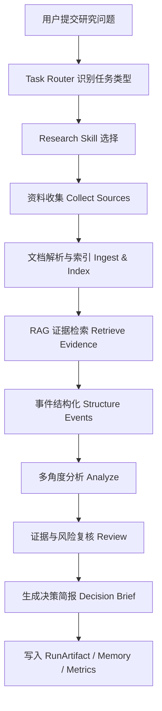
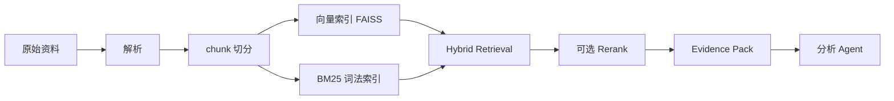
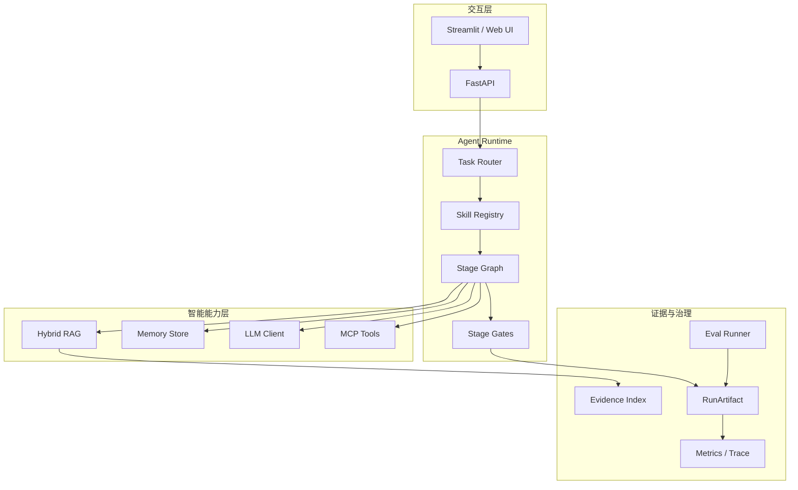

# Enterprise Intelligence Decision Agent

> 面向企业战略、运营、投研和政策研究场景的可审计研究 Agent。
> 本文档是 CoursePilot 的二次开发方向 README，用于把现有学习型 Agent 升级为真实 ToB 决策辅助原型。

## 1. 项目定位

Enterprise Intelligence Decision Agent 是一个面向企业知识工作流的研究型 Agent 系统。它的目标不是做通用聊天助手，而是帮助企业团队把分散在政策文件、行业新闻、竞品动态、招投标公告、财报、研报和内部文档中的信息，转化为可追溯、可复核、可交付的决策简报。

一句话概括：

```text
输入一个企业研究问题，系统自动收集资料、构建证据库、检索关键证据、结构化事件、多角度分析、生成决策简报，并记录完整运行证据。
```

典型问题：

- 某政策变化对新能源供应链企业有什么影响？
- 某竞品最近三个月在产品、渠道、融资、招投标上有什么动作？
- 某行业是否值得进入？机会、风险、证据分别是什么？
- 某上市公司财报和公告反映出哪些经营变化？
- 某类招投标公告是否说明客户预算正在释放？

项目最终想证明的能力：

```text
我能把 Agent 落到真实企业流程里，而不是只做一个 RAG 问答 Demo。
```

## 2. 为什么选择这个场景

中国未来 Agent 落地最大的机会不在单纯陪聊，而在企业流程、产业运营和专业决策辅助。这个方向更适合当前项目的原因有三个：

1. 企业有明确 ROI：减少人工资料收集、压缩研究周期、提升报告质量、沉淀组织知识。
2. 技术链路与现有项目匹配：RAG、Memory、MCP 工具调用、多 Agent 编排、RunArtifact、评估和工具治理都能自然落入这个场景。
3. 面试表达更强：面试官可以追问真实流程、数据来源、错误处理、评估指标、权限控制、证据可追溯性，而不是只听功能介绍。

政策和产业背景：

- 国务院《关于深入实施“人工智能+”行动的意见》提出推动人工智能与经济社会各行业深度融合，并强调产业、治理、民生等重点领域。参考：中国政府网 <https://www.gov.cn/zhengce/zhengceku/202508/content_7037862.htm>
- 工信部在“人工智能+制造”相关工作中提到工业质检、设备故障预测、数字孪生、行业数据集、行业大模型等典型场景。参考：工信部 <https://www.miit.gov.cn/xwfb/mtbd/wzbd/art/2025/art_c714465043e64b44a9c794899974047c.html>
- 企业级 AI 应用研究中，Agent 被视为企业流程重构的重要载体，Function Call、MCP、Skills 等机制用于把 Agent 接入业务流程。参考：艾瑞咨询相关摘要 <https://stock.finance.sina.com.cn/stock/go.php/vReport_Show/kind/search/rptid/821172660387/index.phtml>

因此，这个项目可以被包装为：

```text
一个企业情报研究与决策支持 Agent，重点解决企业信息过载、研究链路不可追溯、结论缺少证据、报告质量难复盘的问题。
```

## 3. 用户与业务场景

### 3.1 目标用户

| 用户 | 真实工作 | Agent 价值 |
|---|---|---|
| 战略分析师 | 研究市场进入、竞品动态、政策变化 | 自动收集材料、提炼事件、输出结论和风险 |
| 运营负责人 | 跟踪业务指标、舆情、渠道反馈 | 把碎片化信息整理成每日/每周经营简报 |
| 投研分析师 | 阅读财报、公告、研报、政策 | 快速定位证据，生成观点初稿和风险清单 |
| ToB 销售/解决方案团队 | 分析客户行业、招投标和预算信号 | 找到客户需求变化和可切入机会 |
| 管理层助理 | 汇总跨部门信息，准备会议材料 | 生成可追溯的决策摘要和行动建议 |

### 3.2 高频任务

| 任务 | 输入 | 输出 |
|---|---|---|
| 政策影响分析 | 政策文件、新闻、行业资料 | 影响对象、机会、风险、行动建议 |
| 竞品动态监控 | 竞品名称、时间范围、公开新闻 | 产品动作、渠道动作、融资/招投标、威胁判断 |
| 行业进入研究 | 行业关键词、目标区域 | 市场结构、政策环境、竞争格局、进入建议 |
| 财报/公告解读 | 年报、季报、公告 PDF | 关键指标变化、经营信号、风险提示 |
| 招投标机会扫描 | 行业关键词、区域、客户类型 | 预算释放信号、重点客户、可跟进线索 |

## 4. 当前项目基础

这个方向不是从零开始，而是基于两个已有项目组合：

### 4.1 CoursePilot 可复用能力

| 当前模块 | 已有能力 | 在新项目中的角色 |
|---|---|---|
| `rag/ingest.py`、`rag/retrieve.py` | 文档解析、向量检索、BM25/Hybrid 检索 | 企业资料证据库 |
| `core/orchestration/runner.py` | 中心编排，多模式执行 | 研究任务主编排器 |
| `core/agents/router.py` | 生成 `need_rag`、`allowed_tools`、`task_type` 等计划 | 任务路由与执行计划 |
| `mcp_tools/client.py` | MCP 工具调用链路 | 搜索、文件、时间、外部工具接入 |
| `memory/store.py` | SQLite 记忆与历史记录 | 组织知识沉淀、历史研究复用 |
| `core/orchestration/policies.py` | `ToolPolicy`、工具 preflight | 工具权限和调用前检查 |
| `core/harness/runtime.py` | `HarnessRuntime`、RunArtifact、生命周期事件 | 运行证据、复盘和可观测性 |
| `core/harness/skills.py` | `SkillSpec`、`SkillRegistry` | 企业研究 Skill 定义 |
| `backend/api.py` | FastAPI 接口和流式响应 | 产品 API 层 |
| `frontend/streamlit_app.py` | 前端交互 | Demo 和面试展示界面 |

### 4.2 insight_engine 可复用能力

| 当前模块 | 已有能力 | 在新项目中的角色 |
|---|---|---|
| `src/insight_engine/harness/graph.py` | stage graph 流程控制 | 企业研究任务阶段流 |
| `src/insight_engine/harness/stage_gates.py` | 每个 stage 后的机械化校验 | 报告质量、格式、证据检查 |
| `src/insight_engine/harness/tool_gateway.py` | 工具网关与权限控制 | 企业级工具调用边界 |
| `src/insight_engine/harness/context_router.py` | 按 stage 裁剪上下文 | 控制上下文窗口和资料注入 |
| `src/insight_engine/harness/hooks/` | LLM 调用后 hook、stage hook | Trace、审计、失败记录 |
| `src/insight_engine/skill_executors/daily_news_report.py` | 单次运行 artifact 汇总 | 研究报告 run_artifact |
| `scripts/harness_linter.py` | 静态约束检查 | CI / 面试证明“不是只写文档” |
| `skills/daily_news_report/SKILL.md` | Skill 文件规范 | 企业研究 Skill 模板 |

组合后的核心变化：

```text
CoursePilot 提供 RAG / Memory / MCP / API / Runner 底座。
insight_engine 提供 stage flow / gates / hooks / run_artifact / harness 约束。
新项目把两者组合成企业研究决策 Agent。
```

## 5. 核心流程

### 5.1 总体流程



### 5.2 Stage 设计

| Stage | 目标 | 输入 | 输出 | Gate 检查 |
|---|---|---|---|---|
| `task_intake` | 明确研究问题、行业、时间范围、输出格式 | 用户 query | `ResearchTask` | 必须包含主题、时间范围、目标用户 |
| `collect_sources` | 收集政策、新闻、公告、财报、研报等资料 | `ResearchTask`、工具权限 | `RawSource[]` | 每条资料必须有 URL/文件名/时间 |
| `ingest_sources` | 文档解析、切分、索引 | `RawSource[]` | `EvidenceIndex` | chunk 数、空文本率、来源字段 |
| `retrieve_evidence` | 根据问题检索关键证据 | query、index | `Evidence[]` | 每个观点至少有证据候选 |
| `structure_events` | 把资料变成结构化事件 | `Evidence[]` | `Event[]` | 事件必须有主体、动作、时间、证据 |
| `analyze_insights` | 输出机会、风险、趋势、竞争判断 | `Event[]` | `Insight[]` | 洞察必须绑定证据和置信度 |
| `review_and_eval` | 检查幻觉、证据不足、逻辑跳跃 | `Insight[]`、`Evidence[]` | `ReviewResult` | 不合格则回退检索或降级输出 |
| `generate_brief` | 生成最终决策简报 | 通过复核的洞察 | `DecisionBrief` | 必须包含结论、证据、风险、行动建议 |
| `persist_artifact` | 留痕和复盘 | 全链路状态 | `RunArtifact` | artifact schema 必须完整 |

### 5.3 为什么要拆 stage

企业决策场景不允许“模型一口气生成一篇报告”。原因：

- 结论必须可追溯，否则无法被管理层信任。
- 每个阶段的错误类型不同，资料收集错、检索错、分析错、报告错不能混在一起。
- 失败后需要局部重试，例如只重新检索证据，而不是重跑整条链路。
- 面试时可以清楚解释系统控制点，而不是只说“调用大模型生成报告”。

## 6. Skill 设计

新项目的 Skill 不只是 prompt 文件，而是“可触发、可约束、可评估的业务能力”。

### 6.1 Skill 列表

| Skill ID | 场景 | 输入 | 输出 |
|---|---|---|---|
| `research.policy_impact.v1` | 政策影响分析 | 政策文件/政策关键词/行业 | 政策摘要、影响对象、机会、风险、建议 |
| `research.competitor_watch.v1` | 竞品监控 | 竞品名、时间范围、关注维度 | 竞品动作表、威胁判断、应对建议 |
| `research.tender_signal.v1` | 招投标机会扫描 | 行业关键词、区域、客户类型 | 招投标线索、预算信号、客户优先级 |
| `research.financial_report.v1` | 财报/公告解读 | 财报 PDF、公司名称 | 指标变化、经营信号、风险点 |
| `research.market_entry.v1` | 行业进入分析 | 目标行业、区域、资源约束 | 进入机会、壁垒、竞品、推荐路径 |

### 6.2 Skill 文件规范

每个 Skill 至少包含：

```text
1. 触发条件：什么用户意图会触发该 Skill
2. 输入约束：必须提供哪些字段，缺失时如何追问
3. 数据来源：允许使用哪些资料和工具
4. Stage 流程：该 Skill 会经过哪些 stage
5. 输出格式：最终报告的结构化字段
6. 质量标准：证据数量、引用要求、风险提示、禁止事项
7. 失败兜底：资料不足、检索为空、证据冲突时如何降级
```

示例：

```text
Skill: research.competitor_watch.v1

触发条件：
- 用户要求分析某公司、某产品、某竞品最近动态。

必填输入：
- competitor_name
- time_range
- industry

输出：
- executive_summary
- event_timeline
- product_moves
- channel_moves
- hiring_or_financing_signals
- tender_or_customer_signals
- risk_assessment
- recommended_actions

质量要求：
- 每个关键结论至少绑定 1 条证据。
- 没有证据的内容只能放入“待验证假设”，不能写成事实。
- 如果公开资料不足，必须明确说明资料缺口。
```

## 7. RAG 与证据链设计

### 7.1 RAG 不只是问答

在这个项目里，RAG 的职责不是“让回答更像懂行业”，而是建立可审计证据链。

RAG 需要回答四个问题：

1. 这条结论来自哪份资料？
2. 原文片段是什么？
3. 资料发布时间和适用范围是什么？
4. 如果证据不足，系统是否明确降级？

### 7.2 检索流程



### 7.3 Evidence Pack

每个证据片段建议统一成如下结构：

```json
{
  "evidence_id": "ev_001",
  "source_type": "policy|news|tender|financial_report|internal_doc",
  "title": "资料标题",
  "source": "URL 或文件路径",
  "published_at": "2026-05-26",
  "chunk_id": "doc_001_chunk_008",
  "page": 12,
  "text": "原文片段",
  "score": 0.83,
  "used_by_claims": ["claim_001"]
}
```

### 7.4 检索指标

MVP 阶段至少记录：

| 指标 | 含义 |
|---|---|
| `retrieval_empty_rate` | 检索为空比例 |
| `evidence_coverage` | 最终结论中有证据支撑的比例 |
| `citation_precision_sampled` | 抽样检查引用是否真的支持结论 |
| `source_freshness` | 资料是否落在用户指定时间范围内 |
| `top_k_hit_rate` | 标注样本中目标证据是否出现在 top-k |

## 8. 工具治理

企业场景里，工具调用必须可控。

### 8.1 工具分类

| 工具类型 | 示例 | 风险 | 策略 |
|---|---|---|---|
| 只读工具 | 本地文档检索、memory_search | 低 | 默认允许，记录日志 |
| 外部检索 | websearch、招投标搜索、公告搜索 | 中 | 限制频率，记录 query 和来源 |
| 写入工具 | filewriter、artifact writer | 中 | 只允许写入指定目录 |
| 企业系统工具 | CRM、ERP、工单、数据库 | 高 | MVP 只做 mock，生产需审批和审计 |

### 8.2 ToolPolicy 需要升级的点

当前 CoursePilot 已有 `ToolPolicy.tool_preflight()`，后续可以升级为：

```text
ToolDecision:
  - allow: 允许调用
  - deny: 拒绝调用
  - ask: 需要人工确认
  - defer: 当前 stage 不允许，转到后续 stage

ToolRiskLevel:
  - safe_read
  - external_read
  - write_local
  - enterprise_action
```

### 8.3 面试可讲点

```text
我没有把 Function Calling 当成一个简单 API 调用，而是做了工具治理：
先由 Skill 和 Stage 限定当前允许使用的工具，再由 ToolPolicy 做参数、阶段、权限检查。
每次工具调用都会进入 trace 和 RunArtifact，后续可以复盘某个结论到底用了哪些工具和资料。
```

## 9. Harness 与可审计运行

这个项目最重要的差异点是：每次运行都留下完整证据，而不是只展示最终回答。

### 9.1 RunArtifact

一次运行应该至少保存：

```json
{
  "run_id": "run_20260526_001",
  "task": {},
  "selected_skill": "research.competitor_watch.v1",
  "stage_timeline": [],
  "sources": [],
  "retrieval": [],
  "structured_events": [],
  "insights": [],
  "review_result": {},
  "final_brief": {},
  "tool_calls": [],
  "metrics": {},
  "errors": []
}
```

### 9.2 Stage Gates

每个 stage 后都要检查产物是否合格：

| Gate | 检查内容 |
|---|---|
| `source_gate` | 来源是否为空、是否有时间、是否重复 |
| `retrieval_gate` | 检索结果是否足够、是否命中指定时间范围 |
| `event_gate` | 事件是否有主体、动作、时间、证据 |
| `insight_gate` | 洞察是否绑定证据和置信度 |
| `review_gate` | 是否存在无证据结论、证据冲突、过度推断 |
| `brief_gate` | 最终报告是否包含结论、证据、风险、建议 |

### 9.3 失败兜底

| 失败类型 | 处理 |
|---|---|
| 资料不足 | 追问用户上传资料或降级为“公开资料初筛” |
| 检索为空 | query rewrite，扩大关键词，或切换 BM25 |
| 证据冲突 | 在报告中标注“证据冲突”，不强行给单一结论 |
| 工具失败 | 记录失败原因，使用已有资料生成保守版本 |
| LLM 输出格式错误 | 重新要求结构化输出，超过次数后降级 |
| 引用不支持结论 | 移入“待验证假设”，不能写进核心结论 |

## 10. 输出格式

最终简报不是长篇散文，而是决策者能快速扫读的结构化报告。

### 10.1 Decision Brief

```text
# 决策简报：某行业进入机会分析

## 1. 结论摘要
- 推荐：谨慎进入 / 重点关注 / 暂不进入
- 核心理由：3 条以内
- 置信度：高 / 中 / 低

## 2. 关键证据
| 证据 | 来源 | 时间 | 支撑的结论 |

## 3. 机会分析
| 机会 | 证据 | 影响 | 优先级 |

## 4. 风险分析
| 风险 | 证据 | 影响 | 缓解建议 |

## 5. 竞争/政策/客户信号
| 信号 | 解释 | 证据 |

## 6. 建议行动
- 立即行动
- 需要验证
- 暂缓事项

## 7. 资料缺口与待验证假设
- 哪些结论证据不足
- 还需要补充什么数据
```

### 10.2 Claim 结构

最终报告中的每个关键观点建议结构化保存：

```json
{
  "claim_id": "claim_001",
  "claim": "新能源汽车产业链上游材料企业可能受益于某政策补贴。",
  "confidence": "medium",
  "evidence_ids": ["ev_001", "ev_008"],
  "risk": "政策执行细则尚未明确，不能直接推断订单增长。",
  "status": "supported"
}
```

## 11. 记忆系统

企业研究 Agent 的 Memory 不是简单保存聊天记录，而是沉淀可复用的组织知识。

### 11.1 Memory 类型

| 类型 | 示例 | 用途 |
|---|---|---|
| `research_case` | 某次完整行业研究 | 复用历史分析框架 |
| `company_profile` | 竞品/客户画像 | 后续研究自动补充背景 |
| `validated_claim` | 已被证据支持的结论 | 减少重复分析 |
| `rejected_claim` | 被复核否定的推断 | 避免重复幻觉 |
| `user_preference` | 用户偏好的报告格式 | 个性化输出 |

### 11.2 写入规则

不是所有内容都写入长期记忆：

- 成功通过 review gate 的结论可以写入。
- 证据不足的假设不能写入事实记忆。
- 工具失败、检索为空、低置信度输出只能写入运行日志。
- 用户明确纠正后的内容要标记为高优先级记忆。

## 12. MVP 范围

### 12.1 第一版只做一个强场景

推荐 MVP 只做：

```text
竞品动态监控 + 决策简报生成
```

原因：

- 公开数据容易获取。
- 不需要真实企业内部权限。
- 面试官容易理解业务价值。
- 能覆盖资料收集、RAG、结构化事件、分析、复核、报告生成全链路。

### 12.2 MVP Demo

示例输入：

```text
请分析 A 公司在过去 90 天内的产品、渠道、融资和招投标动态，
判断它是否会对我们的企业服务业务造成威胁，并输出一份管理层简报。
```

示例输出：

```text
1. 结论：A 公司近期主要威胁来自渠道扩张，而不是产品能力突破。
2. 证据：列出 5-10 条新闻/公告/招投标证据。
3. 风险：公开资料不足，无法确认真实成交金额。
4. 建议：跟踪重点客户、更新销售话术、补充竞品功能对比。
5. Artifact：输出本次运行的 sources、events、claims、tool_calls、metrics。
```

### 12.3 MVP 不做什么

- 不接真实企业 CRM/ERP。
- 不自动执行采购、销售、投放等高风险动作。
- 不声称能替代分析师做最终决策。
- 不声称所有结论都 100% 正确。
- 不做泛泛的“万能 Agent 平台”。

## 13. 技术架构



## 14. 建议目录结构

```text
course-pilot-main/
  core/
    agents/
      enterprise_router.py
      research_analyst.py
      evidence_reviewer.py
      brief_writer.py
    harness/
      runtime.py
      skills.py
      artifact.py
      stage_gates.py          # 可从 insight_engine 迁移思想
    orchestration/
      runner.py
      policies.py
  rag/
    ingest.py
    retrieve.py
    lexical.py
    store_faiss.py
  enterprise/
    schemas.py
    stages/
      collect_sources.py
      ingest_sources.py
      retrieve_evidence.py
      structure_events.py
      analyze_insights.py
      review_claims.py
      generate_brief.py
    skills/
      policy_impact.md
      competitor_watch.md
      tender_signal.md
      financial_report.md
    evals/
      cases_competitor_watch.jsonl
      run_eval.py
  outputs/
    enterprise_runs/
      run_xxx/
        run_artifact.json
        decision_brief.md
        evidence_table.csv
```

说明：

- `enterprise/` 是建议新增的业务域目录，避免把学习场景和企业研究场景混在一起。
- `core/harness/` 保留通用 runtime 能力。
- `rag/`、`memory/`、`mcp_tools/` 尽量复用现有实现。

## 15. 评估体系

### 15.1 评估目标

这个项目的评估不只看回答好不好看，而是看：

```text
检索是否找到证据，证据是否支持结论，结论是否有边界，输出是否符合业务格式。
```

### 15.2 指标

| 维度 | 指标 | 说明 |
|---|---|---|
| 检索 | `hit@k` | 标注证据是否出现在 top-k |
| 检索 | `empty_rate` | 检索为空比例 |
| 证据 | `claim_evidence_coverage` | 核心结论绑定证据比例 |
| 忠实度 | `unsupported_claim_rate` | 无证据结论比例 |
| 格式 | `schema_pass_rate` | 输出是否符合结构化 schema |
| 工具 | `tool_failure_rate` | 工具调用失败比例 |
| 运行 | `stage_retry_rate` | stage 重试比例 |
| 性能 | `p50/p95_latency` | 响应延迟 |
| 人工复核 | `human_acceptance_rate` | 分析师接受率 |

### 15.3 Eval Case

```json
{
  "case_id": "competitor_watch_001",
  "task": "分析某竞品最近 90 天动态",
  "gold_evidence": ["新闻A", "公告B", "招投标C"],
  "required_sections": ["summary", "timeline", "risk", "actions"],
  "forbidden": ["没有证据却写成事实", "忽略资料时间范围"]
}
```

## 16. 研发路线图

### Phase 0：项目重命名和文档对齐

- 新增本 README。
- 明确项目不是学习助手，而是企业情报决策 Agent 的二次开发方向。
- 梳理 CoursePilot 和 insight_engine 能复用的模块。
- 准备面试讲法，避免过度宣称。

### Phase 1：MVP 可运行链路

目标：

```text
竞品动态监控任务可以端到端运行，并输出 decision_brief.md 和 run_artifact.json。
```

任务：

- 定义 `ResearchTask`、`RawSource`、`Evidence`、`Event`、`Claim`、`DecisionBrief` schema。
- 新增 `research.competitor_watch.v1` Skill。
- 复用 CoursePilot RAG 构建 Evidence Index。
- 实现 stage flow：collect -> ingest -> retrieve -> structure -> analyze -> review -> brief。
- 输出 `run_artifact.json`。

### Phase 2：质量门控和评估

目标：

```text
证明系统不是主观 demo，而是可以用指标评估。
```

任务：

- 增加 stage gates。
- 增加 eval cases。
- 统计 evidence coverage、unsupported claim rate、schema pass rate。
- 把失败样本写入 debug artifact。

### Phase 3：多 Skill 扩展

目标：

```text
从一个强场景扩展到 3-5 个企业研究 Skill。
```

任务：

- 政策影响分析。
- 招投标机会扫描。
- 财报/公告解读。
- 市场进入分析。
- 历史研究 Memory 复用。

### Phase 4：企业级治理增强

目标：

```text
让项目具备更强 ToB 可信度。
```

任务：

- 工具风险分级。
- 人工审批点。
- 多租户/项目空间隔离。
- 权限和审计日志。
- 报告版本管理。
- 私有化部署说明。

## 17. 面试讲法

### 17.1 3 分钟版本

```text
我做的是一个企业情报决策 Agent，目标不是通用问答，而是解决企业分析师每天要读大量政策、新闻、公告、财报和竞品资料，但人工整理慢、结论不可追溯的问题。

系统会把一个研究任务拆成多个 stage：资料收集、文档解析和索引、RAG 检索证据、结构化事件、多角度分析、证据复核、生成决策简报。每个关键结论都必须绑定证据来源，如果证据不足，会被降级成待验证假设，而不是写成事实。

技术上我复用了 CoursePilot 里的 Hybrid RAG、Memory、MCP 工具调用、Runner 和 ToolPolicy，又结合 insight_engine 里的 stage graph、stage gates、ToolGateway 和 run_artifact 思路，把一次 Agent 运行变成可复盘的过程。最终不只返回报告，还会保留 sources、retrieval、events、claims、tool_calls、metrics，方便评估和 debug。

这个项目最核心的点是把 Agent 从聊天体验落到企业研究工作流里：有业务输入、有阶段产物、有工具治理、有证据链、有评估指标。
```

### 17.2 面试官可能追问

| 追问 | 回答重点 |
|---|---|
| 为什么不用一个 prompt 直接生成报告？ | 企业决策需要证据和复核，拆 stage 可以定位错误、局部重试、做质量门控 |
| RAG 在这里解决什么问题？ | 不是泛知识增强，而是证据链构建和引用约束 |
| 怎么防幻觉？ | claim 必须绑定 evidence；review gate 检查无证据结论；证据不足降级 |
| Skills 怎么设计？ | 每个 Skill 有触发条件、输入约束、工具权限、stage flow、输出 schema、质量标准 |
| 工具调用怎么控？ | Skill + Stage 限定工具集合，ToolPolicy 做 preflight，调用写入 artifact |
| 怎么证明有效？ | hit@k、evidence coverage、unsupported claim rate、schema pass rate、人审接受率 |
| 当前项目边界是什么？ | MVP 是竞品动态监控，不接真实企业系统，不自动执行高风险动作 |

## 18. 不要过度宣称

面试中不要这样说：

```text
我做了一个完整企业级 Agent 平台。
系统可以自动替代分析师做决策。
系统已经接入真实企业 CRM/ERP。
系统能保证结论完全正确。
```

推荐这样说：

```text
这是一个企业情报决策 Agent 原型，重点验证研究任务拆解、证据链、工具治理、stage gate 和 run artifact。
当前 MVP 聚焦竞品动态监控，先用公开数据和模拟企业流程证明端到端链路。
如果进入生产环境，还需要补充权限体系、人工审批、企业数据接入、安全评估和更大规模 eval。
```

## 19. 项目亮点总结

| 亮点 | 为什么重要 |
|---|---|
| ToB 决策场景 | 比学习助手更接近企业真实预算和岗位需求 |
| Stage 化流程 | 能讲清楚 Agent 如何解决实际问题 |
| Evidence-first RAG | 每个结论可追溯，避免普通 RAG Demo |
| Skill 规范 | 把业务能力变成可触发、可约束、可评估模块 |
| Tool Governance | 体现工程落地能力，不只是 Function Calling |
| RunArtifact | 每次运行可复盘、可 debug、可评估 |
| Eval 指标 | 能回答“怎么证明系统变好了” |
| CoursePilot + insight_engine 组合 | 复用已有技术栈，同时补上企业级控制面 |

## 20. 最小可展示成果

为了让面试官相信这是实际项目，最小展示包应该包含：

```text
1. 一个真实或半真实研究任务
2. 5-20 份公开资料
3. 一次完整运行的 run_artifact.json
4. 一份 decision_brief.md
5. 一张 stage timeline
6. 一组 eval 指标
7. 一个失败案例及修复说明
```

最强展示方式：

```text
我不是只展示最终报告，而是打开 run_artifact，展示：
- 系统收集了哪些资料
- RAG 检索到了哪些证据
- 哪些事件被结构化
- 哪些结论被 evidence 支撑
- 哪些结论被 review gate 降级
- 哪些工具被调用
- 哪些指标说明这次运行质量合格
```

这就是本项目区别于普通 AI Demo 的地方。
